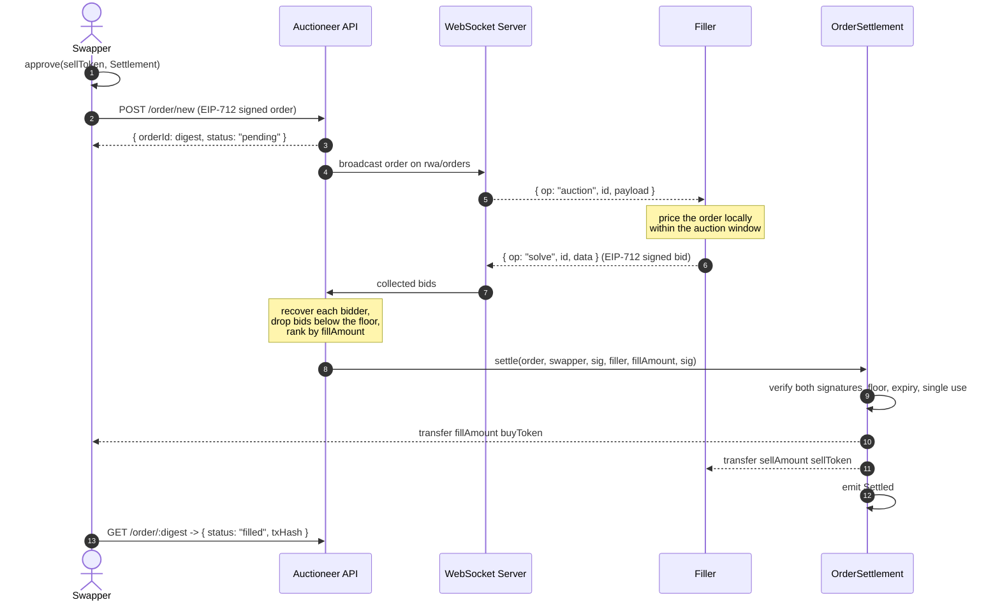
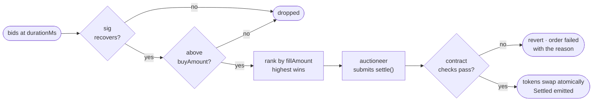

# RedStone Instant Redemption

Instant Redemption lets a holder of a yield-bearing RWA token exit to a stablecoin immediately, instead of waiting out
the issuer's redemption window. The **swapper** signs an order off-chain, **fillers** bid to buy the token, and the best
bid settles on-chain in a single transaction.

This document describes how an external filler connects to the RedStone Instant Redemption WebSocket Server and
competes for those orders.

## Overview



There is no escrow on either side. The swapper keeps custody until the fill and only grants an allowance; you do the
same with your stablecoin. Funds move only when a bid wins.

## 1. Connection

**WebSocket URL**: `wss://<url>.redemption.a.redstone.finance` — RedStone provides the full url for the concrete
integration.

Every connection requires an `x-api-key` HTTP header during the initial WebSocket handshake upgrade. API keys are
provided by RedStone.

- Missing or unauthorized key → `401 Unauthorized`.
- More than 30 concurrent connections on one key → `429 Too Many Requests`.
- The server sends a **ping** after 120s of inactivity. Any compliant client library answers with a **pong**
  automatically.

:::warning
Two disconnects the client **must** handle by reconnecting and resubscribing: no pong within the window closes the
socket with code `1001`, and every connection is forcibly closed after **8 hours** with code `1006`, regardless of
activity.
:::

## 2. Filler Requirements

There is **no deposit and no slashing** — you do not lock capital with RedStone. You need:

1. **A funded address** holding the `buyToken` (the stablecoin the swapper redeems into). It pays the fill and receives
   the RWA token. An EOA or an EIP-1271 smart contract wallet both work — there is no callback contract to deploy.
2. **An allowance** to the Settlement contract for that `buyToken`, from the same address:

   ```javascript
   const erc20 = new ethers.Contract(
     buyToken,
     ["function approve(address spender, uint256 amount) returns (bool)"],
     wallet,
   );
   await erc20.approve(settlementAddress, amount);
   ```

The address that signs your bid **must** be the one holding the funds and the allowance — the Settlement pulls the fill
from the recovered signer.

## 3. Subscription

Subscribe to the `rwa/orders` topic once the connection enters the `OPEN` state:

```json
{ "op": "subscribe", "topic": "rwa/orders" }
```

Unsubscribe with `{ "op": "unsubscribe", "topic": "rwa/orders" }`.

## 4. Bidding

### 4a. The order auction

When a swapper submits an order, the server broadcasts it to every subscriber:

```json
{
  "op": "auction",
  "id": "e9803b9f-4318-4dc0-811d-23f2f0b938f2",
  "timestamp": 1726058300000,
  "durationMs": 1500,
  "payload": {
    "digest": "0x2f1c...",
    "symbol": "mBASIS",
    "settlement": "0x...",
    "chainId": 11155111,
    "order": {
      "sellToken": "0x...",
      "buyToken": "0x...",
      "receiver": "0x0000000000000000000000000000000000000000",
      "sellAmount": "1000000000000000000",
      "buyAmount": "1050000000",
      "validTo": 1726061900,
      "appData": "0x0000000000000000000000000000000000000000000000000000000000000000",
      "feeAmount": "0",
      "kind": "sell",
      "partiallyFillable": false
    }
  }
}
```

| Field                     | Meaning                                                                               |
| ------------------------- | ------------------------------------------------------------------------------------- |
| `digest`                  | EIP-712 hash of the order — its id, and what your bid is signed against.              |
| `symbol`                  | Symbol of the `sellToken`, for logging.                                               |
| `settlement`              | Settlement address — the EIP-712 `verifyingContract` for both the order and the bid.  |
| `chainId`                 | Network the order is signed for.                                                      |
| `durationMs`              | Your deadline. Later responses are discarded.                                         |
| `order.sellToken`         | The RWA token the swapper gives up.                                                   |
| `order.buyToken`          | The stablecoin you pay in.                                                            |
| `order.receiver`          | Who receives the fill. `address(0)` means the swapper.                                |
| `order.sellAmount`        | Exact amount of `sellToken` you receive.                                              |
| `order.buyAmount`         | **The floor.** A fill below this reverts; anything above it is the swapper's surplus. |
| `order.validTo`           | Unix seconds. The order cannot settle after this.                                     |
| `order.kind`              | `"sell"` — the only kind in v1.                                                       |
| `order.partiallyFillable` | `false` — partial fills are not supported in v1.                                      |

Amounts are in each token's own smallest units — `sellAmount` in `sellToken` decimals, `buyAmount` in `buyToken`
decimals. They are **not** normalised.

### 4b. Deciding whether to bid

Pass — by sending nothing — when you do not price the asset, when your offer is below `order.buyAmount`, or when the
fill exceeds your balance or ticket limit. There is no "no bid" frame; the auction ranks whatever arrived in time.

```javascript
const value = (BigInt(order.sellAmount) * assetPrice) / SCALE;
const offer = (value * (10_000n - SPREAD_BPS)) / 10_000n;

if (offer < BigInt(order.buyAmount)) return; // below the floor
if (offer > onHandBalance) return; // cannot pay it
```

### 4c. Submitting the bid

```json
{
  "op": "solve",
  "id": "e9803b9f-4318-4dc0-811d-23f2f0b938f2",
  "data": {
    "bid": "1063000000",
    "liquidationSig": "0x...",
    "nonce": "0",
    "operationCallback": "0x0000000000000000000000000000000000000000",
    "operationData": "0x",
    "maxTxGasPrice": "0"
  }
}
```

Only two fields are read:

- **`bid`** — your `fillAmount`, a plain integer string in `buyToken` smallest units. Must be `>= order.buyAmount`.
- **`liquidationSig`** — your EIP-712 bid signature.

:::warning
The `solve` frame is shared with the RedStone liquidation auction, so its schema requires four fields that mean nothing
here. Send them as the zero values shown above.
:::

### 4d. The bid signature

Your bid is an EIP-712 signature over `Bid(bytes32 order, uint256 fillAmount)` in the **same domain as the order**, so
a bid is only valid against the Settlement it was signed for and cannot be lifted onto another order.

```javascript
const domain = {
  name: "RedstoneInstantRedemption",
  version: "1",
  chainId: payload.chainId,
  verifyingContract: payload.settlement,
};

const BID_TYPES = {
  Bid: [
    { name: "order", type: "bytes32" },
    { name: "fillAmount", type: "uint256" },
  ],
};

const liquidationSig = await wallet.signTypedData(domain, BID_TYPES, {
  order: payload.digest,
  fillAmount,
});
```

:::info
Your address is **recovered from this signature**, not read off the frame. There is no field in which to name yourself,
and a bid you did not sign cannot be attributed to you.
:::

## 5. Ranking & Settlement



The auctioneer submits the winning fill and **pays the gas** — neither the swapper nor the filler sends a transaction.

:::info
The winner is chosen off-chain; the contract enforces the floor, both signatures, and single use. The swapper's
guarantee is "never worse than my floor", not "provably the best price in the world" — the same trust boundary CoW
Protocol has.
:::

## 6. The `OrderSettlement` Contract

You deploy nothing. Settlement is a single RedStone contract that moves both legs atomically.

```solidity
function settle(
    Data calldata o,
    address swapper,
    bytes calldata swapperSig,
    address filler,
    uint256 fillAmount,
    bytes calldata fillerSig
) external;
```

Three intents meet in one call: the **swapper's** signature makes the order a firm offer bounded by `buyAmount` and
`validTo`; the **filler's** signature is consent to this price for this order, without which the auctioneer could spend
your allowance at any price above the floor; and **only the auctioneer may submit**, otherwise a loser could copy the
winning quote out of the mempool.

On success the contract pulls `fillAmount` of `buyToken` from you to the receiver and `sellAmount` of `sellToken` from
the swapper to you, then marks the digest consumed so it can never be filled twice.

### Revert reasons

| Reason                | Cause                                                       |
| --------------------- | ----------------------------------------------------------- |
| `NOT_AUCTIONEER`      | Someone other than the auctioneer called `settle`.          |
| `NOT_SELL`            | `kind` is not `"sell"`.                                     |
| `PARTIAL_UNSUPPORTED` | `partiallyFillable` is `true`.                              |
| `FEE_UNSUPPORTED`     | `feeAmount` is non-zero. No protocol fee exists yet.        |
| `EXPIRED`             | `block.timestamp > validTo`.                                |
| `BELOW_FLOOR`         | `fillAmount < buyAmount`.                                   |
| `ORDER_CONSUMED`      | The order was already filled or cancelled.                  |
| `BAD_SWAPPER_SIG`     | The swapper's signature does not recover.                   |
| `BAD_FILLER_SIG`      | Your bid signature does not recover to the bidding address. |

An insufficient balance or allowance on your side reverts inside the `buyToken` transfer.

### Events

```solidity
event Settled(
    bytes32 indexed order,
    address indexed swapper,
    address indexed filler,
    uint256 sellAmount,
    uint256 fillAmount,
    uint256 surplus
);

event Cancelled(bytes32 indexed order, address indexed swapper);
```

## 7. The Swapper Side

A swapper `POST`s a signed order to `/order/new` (the `OrderDto` is the `order` payload above plus `chainId` and
`signature`) and gets `{ "orderId": digest, "status": "pending" }` back immediately while the auction runs in the
background. Re-POSTing the same order is idempotent.

`GET /order/:digest` returns the result:

```json
{
  "digest": "0x2f1c...",
  "chainId": 11155111,
  "swapper": "0x...",
  "status": "filled",
  "fillAmount": "1063000000",
  "txHash": "0x...",
  "bids": [
    { "filler": "0x...", "fillAmount": "1063000000", "won": true },
    { "filler": "0x...", "fillAmount": "1058200000", "won": false }
  ],
  "createdAt": 1726058300000
}
```

`status` is `pending`, `filled`, or `failed`; a `failed` record carries an `error` with the reason. `bids` lists every
answer that arrived and verified, winner or not — **your address and your price are shown to the swapper**.

The order is signed with the `Order` type in the `RedstoneInstantRedemption` domain:

```javascript
const ORDER_TYPES = {
  Order: [
    { name: "sellToken", type: "address" },
    { name: "buyToken", type: "address" },
    { name: "receiver", type: "address" },
    { name: "sellAmount", type: "uint256" },
    { name: "buyAmount", type: "uint256" },
    { name: "validTo", type: "uint32" },
    { name: "appData", type: "bytes32" },
    { name: "feeAmount", type: "uint256" },
    { name: "kind", type: "string" },
    { name: "partiallyFillable", type: "bool" },
  ],
};
```

An unfilled order can be withdrawn at any time by calling `cancel(order, swapperSig)` on the Settlement directly, which
consumes the digest.

## 8. Reference Filler

Connect, subscribe, price, sign, send:

```javascript
import { Contract, JsonRpcProvider, Wallet } from "ethers";
import { WebSocket } from "ws";

const BID_TYPES = {
  Bid: [
    { name: "order", type: "bytes32" },
    { name: "fillAmount", type: "uint256" },
  ],
};
const SPREAD_BPS = 25n;

const wallet = new Wallet(PRIVATE_KEY, new JsonRpcProvider(RPC_URL));

// one-time: let the Settlement pull our stablecoin
const usdc = new Contract(USDC, ERC20_ABI, wallet);
await (await usdc.approve(SETTLEMENT, MAX_ALLOWANCE)).wait();

const ws = new WebSocket(URL, { headers: { "x-api-key": API_KEY } });

ws.on("open", () =>
  ws.send(JSON.stringify({ op: "subscribe", topic: "rwa/orders" })),
);

ws.on("message", async (raw) => {
  const msg = JSON.parse(String(raw));
  if (msg.op !== "auction" || !msg.payload) return;

  const { id, payload } = msg;
  const { order, digest, chainId, settlement } = payload;

  // price it however you like — a feed, an internal book, a hedge quote
  const value = await valueOf(order.sellToken, order.sellAmount);
  const fillAmount = (value * (10_000n - SPREAD_BPS)) / 10_000n;

  const onHand = await usdc.balanceOf(wallet.address);
  if (fillAmount < BigInt(order.buyAmount) || fillAmount > onHand) return; // pass

  const signature = await wallet.signTypedData(
    {
      name: "RedstoneInstantRedemption",
      version: "1",
      chainId,
      verifyingContract: settlement,
    },
    BID_TYPES,
    { order: digest, fillAmount },
  );

  ws.send(
    JSON.stringify({
      op: "solve",
      id,
      data: {
        bid: fillAmount.toString(),
        liquidationSig: signature,
        nonce: "0",
        operationCallback: "0x0000000000000000000000000000000000000000",
        operationData: "0x",
        maxTxGasPrice: "0",
      },
    }),
  );
});
```
